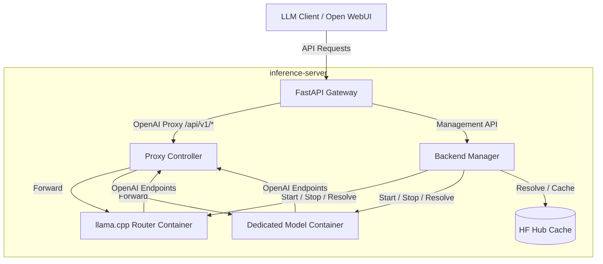

# inference-server

A local LLM gateway and orchestrator for Linux. Manages Docker-based inference backends behind a persistent, OpenAI-compatible API proxy.

---

## Architecture Overview



### How It Works

1. **Client** loads a preset via the management API (`POST /api/backends/{name}/load`).
2. **Backend Manager** unloads the previous model and starts or reuses a Docker container for the new preset using one of two runtime strategies (see below).
3. **Client** sends OpenAI-compatible requests to the gateway (`http://localhost:8000/api/v1`) specifying the loaded `model` preset key.
4. **Proxy Controller** verifies the requested model is loaded, dynamically forwards the request to the active container, and streams responses back to the client.

---

## Key Concepts

### Singleton Orchestrator

Only **one inference workload** is active on the machine at a time. Loading a new preset unloads the previous one. On shutdown, all containers labeled `managed-by: inference-server` are stopped and removed.

### Runtime Strategies

| Strategy | How It Works | Best For |
|---|---|---|
| **Router mode** | Starts a single llama.cpp router container per backend family. Models are loaded and unloaded via API calls to the router. | Fast swaps between models in the same family. |
| **Container mode** | Starts a dedicated Docker container for each model preset. | Switching across different backend families, images, or runtime stacks. |
| **Auto mode** (default) | Uses router mode when the backend family supports it (`router_supported: true`), falls back to container mode otherwise. | General use — recommended. |

Set the strategy globally with `runtime_mode` in your config (`"auto"`, `"router"`, or `"container"`).

### Preset Keys

Clients reference models by **canonical preset key** (e.g. `"gemma"`, `"qwen"`) — not raw Hugging Face filenames. The preset key is sent in the `model` field of OpenAI-compatible requests and maps to a full model configuration in `config.json`.

### Backend Families

A backend family defines the Docker image, GPU device passthrough, shared CLI arguments, and volume mounts for a class of models. Examples: `rocm` (AMD GPUs), `vulkan` (portable GPU compute). Multiple model presets can share the same family.

---

## Features

### Unified OpenAI Proxy (`/api/v1`)

All requests to `/api/v1/...` are proxied to whichever backend is active. Hop-by-hop headers are filtered, and Server-Sent Events (SSE) streaming is fully supported. The endpoint stays alive across model swaps — no client reconfiguration needed.

### Explicit Load / Unload Behavior

To ensure predictable VRAM usage, model presets must be loaded and unloaded explicitly via the `/api/backends/{name}/load` and `/api/backends/{name}/unload` endpoints. The proxy requires the requested model to be active before accepting completions or embeddings requests.

When loading a preset, the active model is automatically and cleanly unloaded first to prevent VRAM out-of-memory errors. Note that model loading is destructive: if the active model belongs to a different backend family, the current runtime will be stopped and torn down first, freeing GPU resources before the new preset's model is validated, downloaded, or started. If the new load fails, the server will correctly report that no active backend is loaded.

### Speculative Decoding

Each model preset can configure speculative decoding independently. Supported types include `draft-mtp`, `draft`, and `ngram-cache`, with per-preset draft model sources.

### Automated HF Hub Cache Downloads

Model presets referencing Hugging Face repositories (via `repo_id` and `filename`) are automatically resolved and downloaded to `hf_cache_dir` when they are loaded. Local files are resolved instantly.

---

## Installation & Tooling

This project uses [`uv`](https://github.com/astral-sh/uv) for dependency management and task running.

```bash
# Clone and enter the project
git clone <repo-url>
cd inference-server

# Run the test suite
uv run pytest

# Lint and format
uv run ruff check .
uv run ruff format .

# Type checking
uv run ty check
```

---

## Configuration

Copy `config.example.json` to your preferred location (default: `~/.config/inference-server/config.json`) or point to a custom path with `INF_CONFIG_PATH`.

### Environment Variables

Create a `.env` file in the project root (see `.env.example`):

| Variable | Description |
|---|---|
| `INF_CONFIG_PATH` | Path to `config.json`. Default: `~/.config/inference-server/config.json` |
| `INF_HOST` | Gateway bind address. Default: `0.0.0.0` |
| `INF_PORT` | Gateway bind port. Default: `8000` |
| `INF_BACKEND_PORT` | Unified host port mapped to the active container. Default: `39281` |
| `INF_HF_TOKEN` | Hugging Face Hub token for gated/private models. Also reads `HF_TOKEN` and `HUGGINGFACE_HUB_TOKEN`. |

### Config File Reference

#### Top-Level Fields

| Field | Type | Default | Description |
|---|---|---|---|
| `runtime_mode` | `"auto"` \| `"router"` \| `"container"` | `"auto"` | Global runtime strategy. |
| `api_prefix` | `string` | `"/api"` | URL prefix for all server routes. |
| `hf_cache_dir` | `string` | — | Absolute path to the local Hugging Face Hub cache directory. |
| `hf_token` | `string \| null` | `null` | HF API token (env var takes precedence). |

#### `backend_families` (object)

Each key is a family name (e.g. `"rocm"`, `"vulkan"`):

| Field | Type | Description |
|---|---|---|
| `docker_image` | `string` | Docker image to use for this family. |
| `devices` | `string[]` | Device paths to pass through to the container (e.g. `["/dev/kfd", "/dev/dri"]`). |
| `volumes` | `object` | Additional volume mounts (`{ "host_path": "container_path" }`). |
| `shared_args` | `string[]` | CLI arguments applied to every model in this family. |
| `router_supported` | `boolean` | Whether this family supports router mode. |

#### `models` (array)

Each entry defines a model preset:

| Field | Type | Description |
|---|---|---|
| `name` | `string` | Canonical preset key (used by clients in the `model` field). |
| `backend_family` | `string` | References a key in `backend_families`. |
| `bind_host` | `string` | Address the container binds to. Default: `"127.0.0.1"`. |
| `connect_host` | `string` | Address the proxy uses to reach the container. Default: `"127.0.0.1"`. |
| `model` | `object` | Model source — requires either `local_path` **or** `repo_id` + `filename`. |
| `model.repo_id` | `string` | Hugging Face repository (e.g. `"ggml-org/gemma-3-1b-it-GGUF"`). |
| `model.filename` | `string` | Specific GGUF file in the repo. |
| `model.revision` | `string` | Repo revision / branch. Default: `"main"`. |
| `model.local_path` | `string` | Absolute path to a local GGUF file (skips HF download). |
| `speculative` | `object` | Speculative decoding config. |
| `speculative.type` | `string` | Decoding strategy: `"draft-mtp"`, `"draft"`, `"ngram-cache"`, etc. |
| `speculative.draft_model` | `object` | Model source for the draft model (same schema as `model`). |
| `extra_args` | `string[]` | Additional CLI flags for this specific preset. |

### Example Configuration

```json
{
  "runtime_mode": "auto",
  "api_prefix": "/api",
  "hf_cache_dir": "/home/you/.cache/huggingface/hub",
  "hf_token": null,
  "backend_families": {
    "rocm": {
      "docker_image": "ghcr.io/ggerganov/llama.cpp:server-rocm",
      "devices": ["/dev/kfd", "/dev/dri"],
      "shared_args": ["-ngl", "99"],
      "router_supported": true
    }
  },
  "models": [
    {
      "name": "gemma",
      "backend_family": "rocm",
      "bind_host": "127.0.0.1",
      "connect_host": "127.0.0.1",
      "model": {
        "repo_id": "ggml-org/gemma-3-1b-it-GGUF",
        "filename": "gemma-3-1b-it-Q4_K_M.gguf"
      },
      "speculative": {
        "type": "draft-mtp"
      }
    }
  ]
}
```

---

## API Reference

### Health & Status

| Method | Endpoint | Description |
|---|---|---|
| `GET` | `/api/healthz` | Health check. |
| `GET` | `/api/status` | Service status including active backend info. |

### Backend Management

| Method | Endpoint | Description |
|---|---|---|
| `GET` | `/api/backends` | List all configured model presets. |
| `POST` | `/api/backends/{name}/load` | Load a model preset by name. |
| `POST` | `/api/backends/{name}/unload` | Unload a model preset by name. |
| `GET` | `/api/backends/{name}/logs` | Retrieve recent container logs for a preset. |

### OpenAI-Compatible Proxy

All standard OpenAI endpoints are available under `/api/v1/`:

```
GET, POST  /api/v1/{path}
```

Common examples:
- `POST /api/v1/chat/completions` — chat (supports SSE streaming)
- `POST /api/v1/embeddings` — embeddings
- `GET  /api/v1/models` — list available models

---

## Client Integration

### Python (OpenAI SDK)

```python
from openai import OpenAI

client = OpenAI(
    base_url="http://localhost:8000/api/v1",
    api_key="not-needed"
)

# Make sure the model preset "gemma" has been explicitly loaded first:
# POST http://localhost:8000/api/backends/gemma/load
response = client.chat.completions.create(
    model="gemma",
    messages=[{"role": "user", "content": "Explain gravity in one sentence."}],
    stream=True
)

for chunk in response:
    print(chunk.choices[0].delta.content or "", end="")
print()
```

### curl (SSE Streaming)

```bash
curl http://localhost:8000/api/v1/chat/completions \
  -H "Content-Type: application/json" \
  -d '{
    "model": "gemma",
    "messages": [{"role": "user", "content": "Why is the sky blue?"}],
    "stream": true
  }'
```
