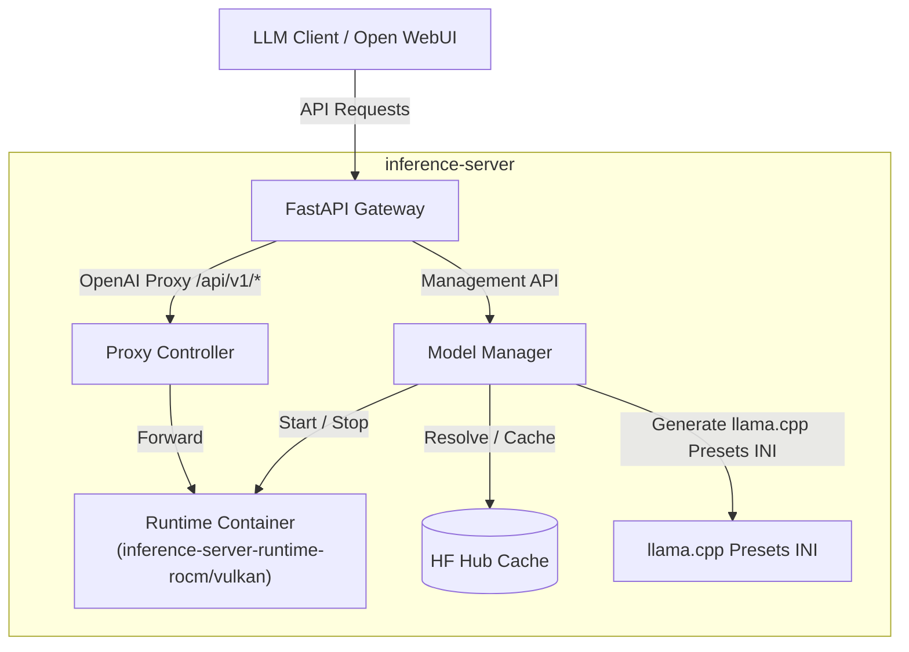

# Architecture

`inference-server` is a single-active-runtime model orchestrator. It manages configured models, loading a selected model onto a selected runtime (e.g. `rocm` or `vulkan`) inside a fresh Docker container for each activation attempt, and exposes it through a stable FastAPI gateway.

## Intended System Model

The system operates under the following contract:
- **Configured Models**: The service manages a list of configured models.
- **Shared Backends**: The service defines shared backend profiles for `rocm`, `vulkan`, or both.
- **Backend-Agnostic Models**: A configured model can be loaded onto any configured backend unless legacy per-model runtime overrides are used.
- **Explicit Runtime**: Loading a model always requires specifying an explicit runtime.
- **Single Active Model**: Only one model may be active at a time.
- **Single Runtime Container**: Only one runtime container may exist at a time.
- **Fresh Activation**: Every `load` attempt starts a fresh runtime container for the requested model/runtime pair.
- **Full Teardown on Unload**: Unloading the active model removes its runtime container instead of keeping a warm backend around.

## Request Flow

## Model and Runtime Management

`inference-server` uses the model preset system of `llama.cpp`'s server, but it does not rely on in-place model swapping as the primary lifecycle:

1. **Backends**: Supports `rocm` and `vulkan` backends. Only one runtime container (either ROCm or Vulkan) can exist at any given time.
2. **Loading a Model**: When a model is loaded, the manager merges the selected backend profile with the model-specific source and llama.cpp arguments, tears down any existing runtime, starts a fresh container, loads the target model, and waits for readiness before returning success.
3. **Unloading a Model**: Unloading the active model stops and removes the runtime container, then clears the active model assignment.
4. **Failure Handling**: If runtime communication fails after a model was marked active, the manager clears the active runtime state and treats the backend as dead until a new load occurs.

Legacy note:
- Older configs may still define `runtimes` on each model. That path is supported for compatibility but is no longer the primary configuration model.

## Proxy Behavior

- Requests to `/api/v1/*` are forwarded to the active runtime container.
- If a JSON request includes `model`, the proxy verifies that the model is configured and currently loaded.
- If no model is loaded, the proxy returns a `400` error.
- If runtime transport fails during proxying, the gateway tears the runtime down and returns `503`.
- SSE streaming is passed through unchanged.

## Model Naming

Clients send the canonical model name, such as `gemma` or `qwen`, in the OpenAI `model` field. The name maps to a configured model inside the server config.
