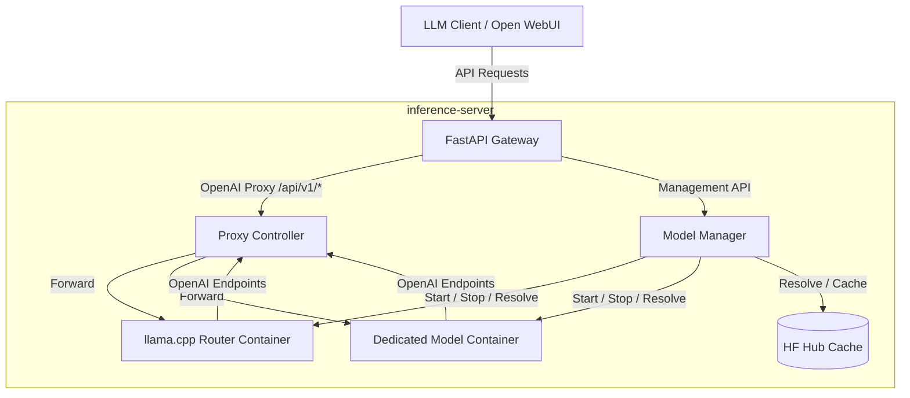

# Architecture

`inference-server` is a single-active-workload orchestrator. It manages Docker-backed inference runtimes and exposes them through a stable FastAPI gateway.

## Request Flow

## Runtime Modes

- `auto`: uses router mode when the backend family supports it, otherwise falls back to container mode.
- `router`: starts one router container per backend family and loads presets into it.
- `container`: starts a dedicated container for each preset.

## Model Loading

- Only one preset is active at a time.
- Loading a preset unloads the current one first.
- If the new preset uses a different backend family or incompatible runtime, the current runtime is stopped and replaced.
- Router mode can swap presets inside the same running router container.

## Proxy Behavior

- Requests to `/api/v1/*` are forwarded to the active model runtime.
- If a JSON request includes `model`, the proxy verifies that the preset is configured and currently loaded.
- If no model is loaded, the proxy returns a `400` error.
- SSE streaming is passed through unchanged.

## Preset Naming

Clients send the canonical preset key, such as `gemma` or `qwen`, in the OpenAI `model` field. The preset key maps to a full model definition in the configuration file.
