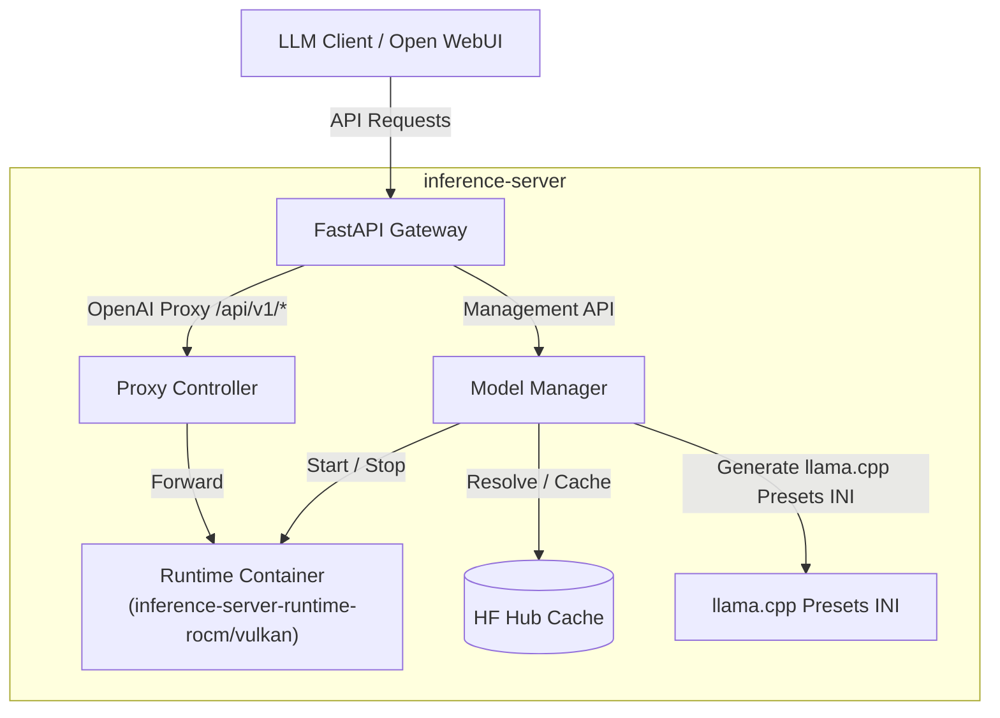

# Architecture

`inference-server` is a single-container model and runtime orchestrator. It manages configured models, loading a selected model onto a selected runtime (e.g. `rocm` or `vulkan`) within a single active Docker container, and exposes it through a stable FastAPI gateway.

## Intended System Model

The system operates under the following contract:
- **Configured Models**: The service manages a list of configured models.
- **Runtimes**: Each model may support `rocm`, `vulkan`, or both runtimes.
- **Explicit Runtime**: Loading a model always requires specifying an explicit runtime.
- **Single Active Model**: Only one model may be active at a time.
- **Single Runtime Container**: Only one runtime container may exist at a time. Loading a new model stops and removes any previous runtime container first.
- **Clean Unload**: Unloading the active model stops the runtime container, leaving no active runtime container in the system.

## Request Flow

## Model and Runtime Management

Instead of spawning separate containers for each model, `inference-server` uses the model preset system of `llama.cpp`'s server:

1. **Runtimes**: Supports `rocm` and `vulkan` runtimes. Only one runtime container (either ROCm or Vulkan) can exist at any given time.
2. **Loading a Model**: When a model is loaded, the manager ensures the corresponding runtime container is running and loads the model into it. Loading a model always requires selecting an explicit runtime.
3. **Unloading a Model**: Unloading the active model stops the runtime container, leaving no active runtime container running.
4. **Active Workload**: Only one model and runtime container are active at a time.

## Proxy Behavior

- Requests to `/api/v1/*` are forwarded to the active runtime container.
- If a JSON request includes `model`, the proxy verifies that the model is configured and currently loaded.
- If no model is loaded, the proxy returns a `400` error.
- SSE streaming is passed through unchanged.

## Model Naming

Clients send the canonical model name, such as `gemma` or `qwen`, in the OpenAI `model` field. The name maps to a configured model inside the server config.
